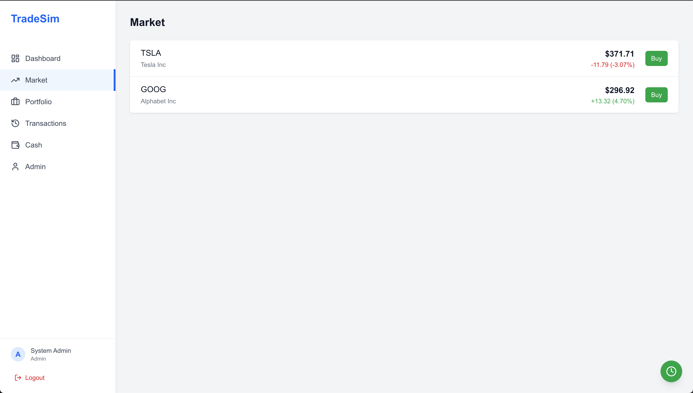
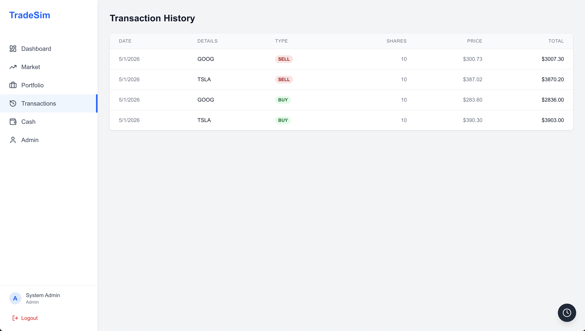
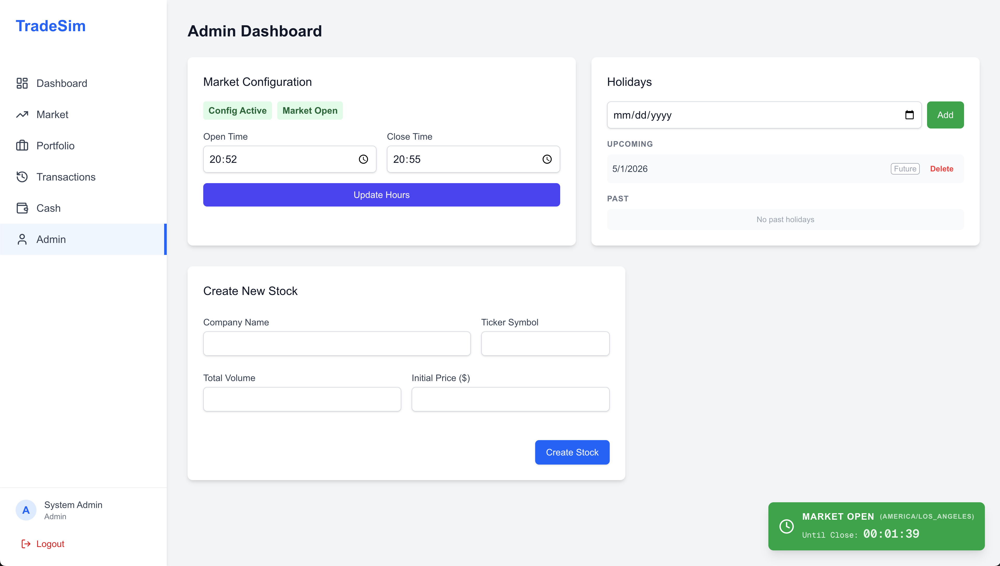

# TradeSim: Real-Time Stock Trading System 📈

**TradeSim** is a full-stack, client/server web application built as a solo capstone project for IFT 401. It simulates a real brokerage environment designed to train stockbrokers on buying and selling stocks. The system supports two user roles — customers (who trade, manage portfolios, and deposit/withdraw cash) and administrators (who create stocks, set prices, and control market hours and holiday schedules).

A core feature is a random stock price generator that simulates realistic OHLC (Open, High, Low, Close) price fluctuations every 10 seconds, broadcasting live updates to all connected clients in real time.

## 📑 Table of Contents
- [🎯 What Problem It Solves](#-what-problem-it-solves)
- [🧠 Why I Built It This Way](#-why-i-built-it-this-way)
- [✨ Core Features](#-core-features)
- [🛠️ Technology Stack](#️-technology-stack)
- [📸 Application Gallery](#-application-gallery)
- [💡 Lessons Learned & What I'd Do Differently](#-lessons-learned--what-id-do-differently)
- [💻 Local Development Setup](#-local-development-setup)
- [☁️ Zero-Touch AWS Deployment](#️-zero-touch-aws-deployment)
- [📜 License](#-license)

---

## 🎯 What Problem It Solves

Stockbroker training traditionally requires expensive simulation software or access to live markets. This system provides a self-contained training environment where brokers can practice reading tickers, managing portfolios, and executing orders — without real financial risk. It mirrors real market behavior closely enough to build intuition, while giving administrators full control over the market's structure and schedule.

---

## 🧠 Why I Built It This Way

This project was intentionally a learning stretch. Every major technology decision was chosen not just to ship a product, but to grow as an engineer.

- **Unconventional Tech Stack — By Design**: The frontend is built with Next.js and TypeScript, neither of which I had used before. I chose them deliberately to challenge myself and measure how fast I could pick up a typed, component-driven framework under real project pressure. The backend, however, runs on Express.js — a framework I had prior experience with. This split let me take a calculated risk on the frontend without destabilizing the whole project.
- **JWT over OAuth 2.0**: My previous experience was exclusively with OAuth 2.0, so I used this project as an opportunity to implement JWT (JSON Web Tokens) for authentication and authorization from scratch. The system uses HS256-signed tokens with role-based access control, enforced server-side via middleware — the server never trusts the client.
- **WebSockets — First Time, Real Stakes**: I had never worked with WebSockets before this project. Rather than avoid the complexity, I used it as the right moment to learn. The real-time pipeline is split into three coordinated services: a Price Generator (writes OHLC data every 10 seconds), a Price Poller (queries the DB every 1–2 seconds for new records), and a WebSocket Service (broadcasts updates to all clients via Socket.io). This separation kept each piece independently testable and prevented a failure in one from cascading into the others.
- **Bottom-Up, Academically Grounded Design**: Built solo, starting from the data model and working upward to the API layer and then the UI. The database schema was designed using principles from Intermediate Database Management coursework, and the requirements and system design process followed structured methodology from Systems Development (avoiding implementation bias). Every layer had a clear contract before the next was built.
- **Atomic Transactions for Trade Integrity**: All buy/sell operations are wrapped in PostgreSQL `BEGIN / COMMIT / ROLLBACK` blocks. A failed mid-trade operation rolls back entirely — no partial cash deductions, no phantom portfolio updates.
- **AWS for Production-Grade Infrastructure**: I wanted hands-on cloud experience beyond a local dev environment. This drove the deployment architecture onto AWS EC2 and forced me to grapple with real-world infrastructure problems (see *Lessons Learned* below).
- **Nginx as a Unified Ingress Layer**: Rather than exposing the Node.js or Next.js servers directly to the internet, I configured Nginx as a reverse proxy. This elegantly solved cross-origin (CORS) issues by serving both the frontend and API under a single port (80), while providing a highly reliable layer to manage the HTTP `Upgrade` headers required for stable WebSocket connections. It mirrors true production-grade DMZ patterns.

---

## ✨ Core Features

- **Live Price Feeds:** Driven by `Socket.io`, pushing updates instantly to all connected clients without HTTP polling.
- **Algorithmic Volatility:** A backend engine generates realistic price fluctuations based on individual stock volatility and market trends.
- **Timezone-Aware Market Hours:** Enforces strict trading hours correctly calculated regardless of the server's local timezone.
- **Idempotent Upserts & Ledger:** Immutable ledger of every trade action logged to PostgreSQL, designed to handle concurrent transaction races.
- **Admin Control Panel:** Admins can inject new IPOs, halt trading, seed initial market conditions, and manage global system state.

---

## 🛠️ Technology Stack

- **Frontend:** Next.js 16 (App Router), React 19, TypeScript, Tailwind CSS, `socket.io-client`
- **Backend:** Node.js, Express.js, `socket.io`
- **Database:** PostgreSQL 15 (Dockerized)
- **Infrastructure:** Docker, Docker Compose, Nginx, AWS EC2, Native Bash Automation (`deploy.sh`)

---

## 📸 Application Gallery


*Live ticker prices and real-time market data.*


*Instant trade execution interface with real-time pricing.*


*Admin controls for market hours, IPOs, and system state.*

---

## 💡 Lessons Learned & What I'd Do Differently

1. **Audit Cloud Costs Before Provisioning:** Initially, the project incurred unexpected AWS charges from NAT Gateways left running in a manual VPC configuration. AWS bills continuously regardless of traffic. Going forward, I will review every managed service's pricing model before deploying and set billing alerts from day one.
2. **Plan Frontend State Management Earlier:** Simultaneously displaying live stock prices, portfolio values, and trade confirmations — all updating from WebSocket events — was more complex than anticipated. I'd define a clear global state management strategy (like Context or Redux) at the architecture stage rather than iterating on it mid-build.
3. **Use Infrastructure-as-Code from the Start:** The initial VPC, subnets, and EC2 instances were configured manually. While it worked, it wasn't reproducible. While I am well aware that industry-standard tools like Terraform or AWS CloudFormation exist for this exact purpose, I simply didn't have the time to learn them before the project deadline. So, leveraging what I already knew (Bash and the AWS CLI), I came up with my own highly sophisticated, "budget" IaC solution—which evolved into the automated `deploy.sh` pipeline you see in this repository today.

---

## 💻 Local Development Setup

If you want to run this application locally on your machine, follow these steps:

### Prerequisites
- Node.js (v18+)
- Docker & Docker Compose

### 1. Clone & Setup Environment Variables
```bash
git clone https://github.com/yourusername/stock-trading-system.git
cd stock-trading-system
```
Create `.env` in `backend` and `.env.local` in `frontend` (use `.env.example` as templates).

### Option A: Run Everything with Docker (Zero Setup)
The easiest way to spin up the entire stack locally is using Docker Compose. This runs the Database, Backend, Frontend, and Nginx proxy exactly as it does in production.
```bash
docker-compose up -d --build
```
The application will be available at `http://localhost`.

### Option B: Manual Local Development (Bypassing Nginx)
If you want to edit code and see hot-reloads, you can run the services individually on their native ports. In this mode, we bypass Nginx entirely. Note that your `frontend/.env.local` must point directly to the backend's native port (`NEXT_PUBLIC_API_URL=http://localhost:5005/api`).

**1. Start the Database**
```bash
docker-compose up -d db
```

**2. Start the Backend API**
```bash
cd backend
npm install
npm run dev
```

**3. Start the Frontend Application** (in a new terminal)
```bash
cd frontend
npm install
npm run dev
```
The application will be available at `http://localhost:3000`.

---

## ☁️ Zero-Touch AWS Deployment

Based on the lessons learned above, this repository now features a highly resilient, fully automated deployment script.

### Prerequisites for Deployment
If you want to deploy this repository to your own AWS account, you will need:
1. An active AWS Account.
2. The AWS CLI installed on your machine (`brew install awscli` or via AWS docs).
3. AWS Credentials configured (with adminaccess to aws resources). Run `aws configure` in your terminal and provide your `AWS_ACCESS_KEY_ID`, `AWS_SECRET_ACCESS_KEY`, and a default region (e.g., `us-east-1`).

### Launching into Production
Simply run the deploy script from the root of the project:
```bash
./deploy.sh
```

**What the script does:**
1. Validates AWS credentials and automatically creates an open Security Group (`trade-sim-sg`).
2. Generates an SSH Key Pair securely.
3. Provisions a new `t3.medium` EC2 instance with an expanded gp3 EBS volume.
4. Archives the source code and securely copies it over SSH.
5. Installs Docker natively on the remote Ubuntu server.
6. Builds and runs the entire architecture via `docker-compose up -d --build`.

**Seeding the Admin Account:**
Once deployed, securely inject the initial admin user into the production database:
```bash
./seed_admin.sh
```

*(To tear down infrastructure and stop billing, use `./destroy.sh`)*

---

## 📜 License
This project is licensed under the MIT License. See the [LICENSE](LICENSE) file for details.
